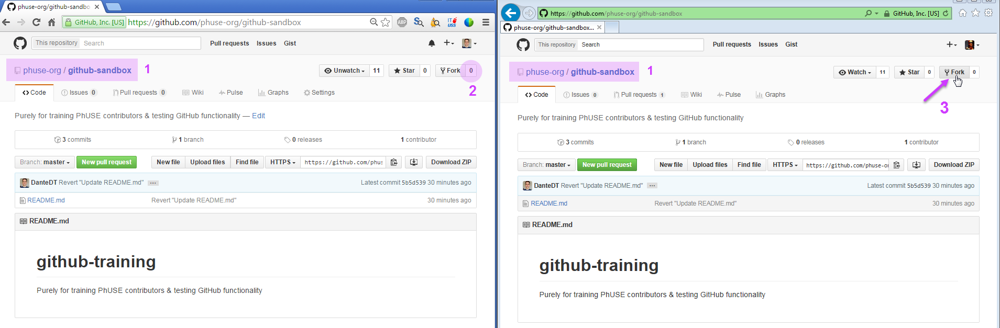
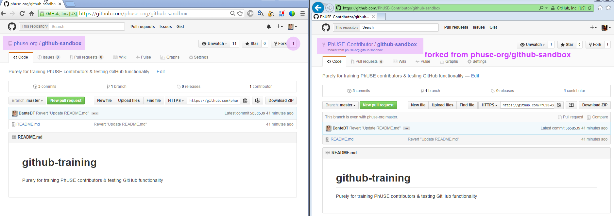
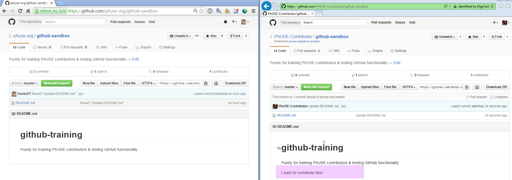
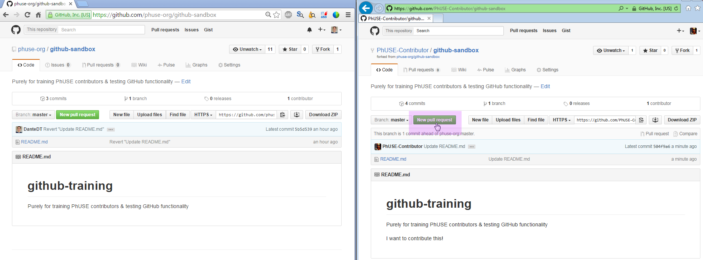
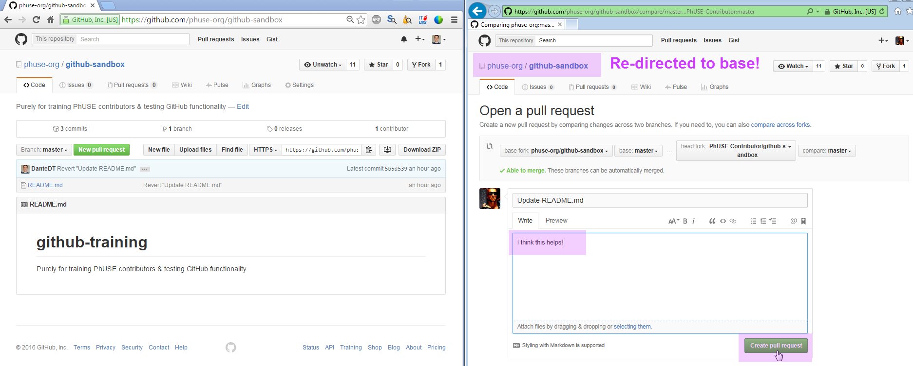
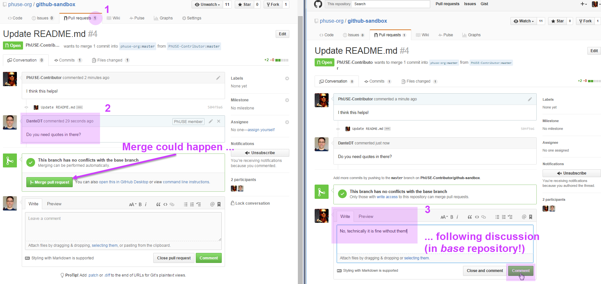
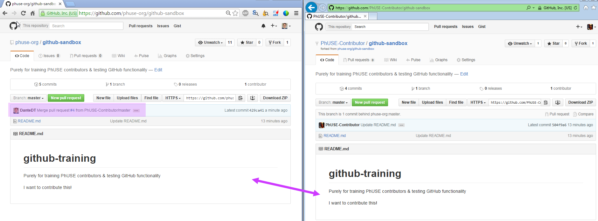
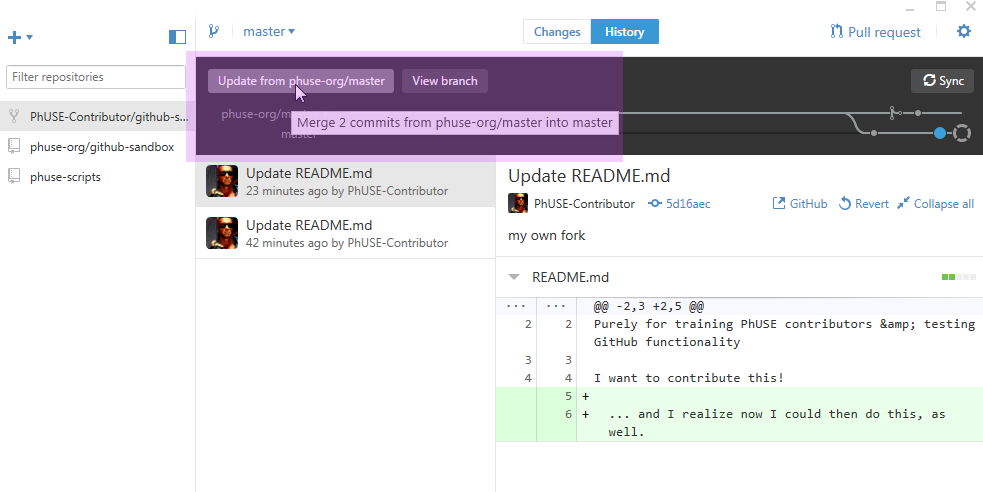
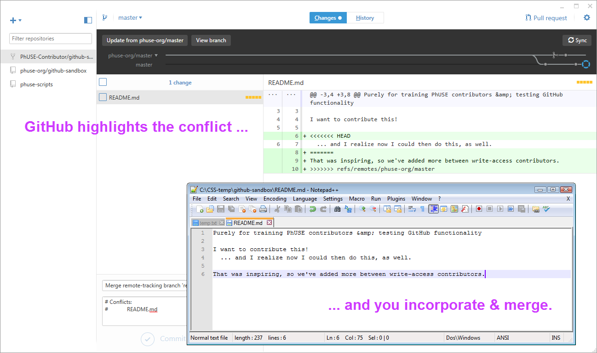
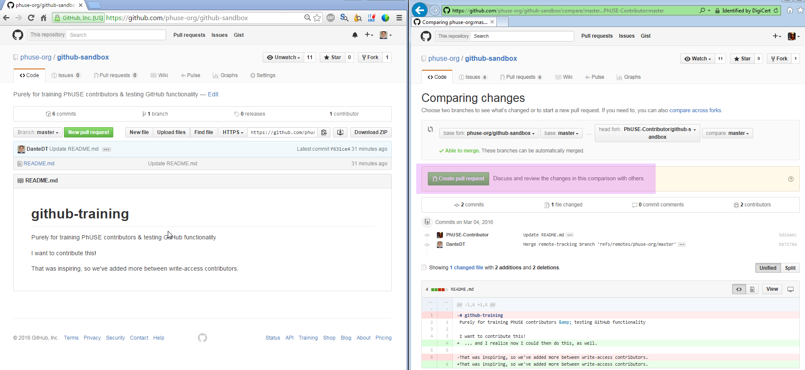

#### Git workflow exercises

These are selected screenshots of the [Git workflow exercises](https://github.com/phuse-org/phuse-scripts/blob/master/docs/guides/Git_workflow_exercises.md)

##### Simple scenario

**EXT. Collaborator forks the phuse-scripts repository:**

**which creates their own forked repository from the original phuse-org/phuse-scripts repo:**

**EXT. Collaborator then creates/modifies files in own fork:**

**EXT. Collaborator then creates a new pull request:**

**which re-directs back to the original base repository, to explain the pull request:**

**Discussion takes place between INT and EXT collaborators, in the pull request in the original repo**

**Back in sync, if the INT Collaborator accepts and merges the requested changes**

##### Substantial change: development of new feature takes some time

**If the INT and EXT Collaborators make conflicting changes:**

  * **the EXT collaborator must merge the latest base repo into his/er own fork.**
  * **GitHub Desktop client makes this easy:**

  * **GitHub highlights the changes, annotating the conflicts in the "cloned" copy of the file.**
  *  **The EXT. collaborators reconciles the conflicts and merges the resulting file into the local clone of their forked repo.**
  *  **GitHub then permits the EXT. collaborator to commit these merged changes into the local clone:**

**The EXT. Collaborator is once again ready to create a new pull request, from the re-synced, modified fork:**

